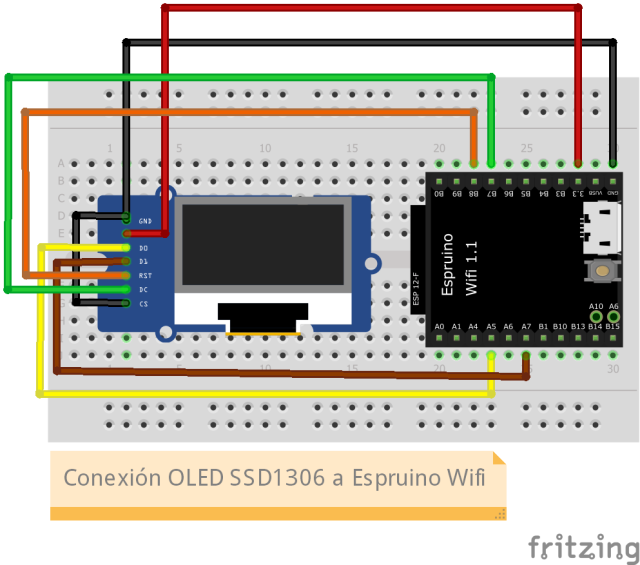

# Espruino-BCCR
Se presenta un proyecto elaborado utilizando el dispositivo [Espruino Wifi](https://shop.espruino.com/espruino-wifi), con el cual se logra consumir el Web Service del Banco Central de Costa Rica para presentar información del tipo de cambio de colón costarricense respecto del dolar estadounidense.

## Sobre Espruino
El [Espruino](https://www.espruino.com/) es un firmware open-source creado por [Gordon Willians](https://www.youtube.com/watch?v=hSyXpM1L4B4), que implementa un interprete de JavaScript para microcontroladores.

Es muy fácil comenzar a experimentar con [Espruino](https://www.espruino.com/), solo se requiere un dispositivo con el firmware y el navegador Google Chrome. [Comienza aquí](https://www.espruino.com/Web+IDE).

Desde mi opinión, entre otras cosas [Espruino](https://www.espruino.com/) facilita el acercamiento de quienes tienen conocimientos de programación con el lenguaje JavaScript (el lenguaje más usado en la Web) a la programación de microcontroladores, un espacio que comúnmente a estado limitado a lenguajes como C/C++, con su correspondiente curva de aprendizaje.

Yo soy desarrollador Web profesional, y el trabajo de Gordon es admirable, quien ha programado profesionalmente puede imaginar el esfuerzo que puede llevar lograr una plataforma como Espruino con un pequeño equipo de trabajo.👍

## Sobre el proyecto

Personalmente la consulta del tipo de cambio colones costarricenses por dólares americanos, es algo que hago con mucha frecuencia durante el día en mi trabajo, y me veo con frecuencia abriendo una ventana en mi navegador para ir el sitio web del [Banco Central de Costa Rica](https://www.bccr.fi.cr/SitePages/Inicio.aspx) y buscar el valor de referencia del tipo de cambio.

Con el proyecto que presento estoy creando un dispositivo del [IoT](https://en.wikipedia.org/wiki/Internet_of_things) (Internet de las cosas). En este caso haciendo uso del [Espruino Wifi](https://shop.espruino.com/espruino-wifi) logro la conexión a un red WiFi, para posteriormente consumir el [Servicio Web que el Banco Central de Costa Rica](https://www.bccr.fi.cr/indicadores-economicos/servicio-web) ofrece al público para la consulta de indicadores financieros, una vez obtenidos los valores del tipo de cambio de colones costarricenses por dólares americanos lo muestro en una pequeña pantalla OLED.

## Implementación

### Hardware
1. Obtener un [Espruino Wifi](https://shop.espruino.com/espruino-wifi). También disponible en [Adafruit](https://www.adafruit.com/product/3514).
2. Obtener una [pantalla OLED](https://www.crcibernetica.com/128-x-64-oled-module/) que utilice el controlador SSD1306 con conexión SPI. Puede ser que esté disponible en tiendas locales de electrónica.
3. Hacer la conexión física del Espruino Wifi la pantalla OLED. Aquí están el diagrama hecho con Fritzing, y la foto como queda finalmente.

### Software

